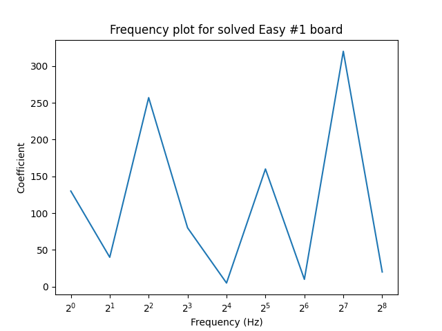

# Frequency Analysis

This document examines how we can find the equation of a surface that fits a board.

We want to find a two-valued function `f(x,y)` that takes the `(x,y)` coordinate of a cell (indexed starting at 0) and 
gives the cell's value. The output of this function is `0` if the cell is dotted, `1` if it is starred, and undefined otherwise.

Throughout this document, we will use the image below as reference, taken from puzzle Easy #1 in the _Star Battle_ app.


_Easy #1_

## Method

### 1. Board row as a spectrum analyser plot
We can define the equation of a row `y` in the board by treating the cell values in that row as if they are peaks on a 
spectrum analyser display. In particular, let's assume that each cell represents a doubling in frequency, starting at 1 Hz. 
The formula for the frequency `F` of a cell `x` in a row is therefore:

<code>F(x) = 2<sup>x</sup></code>

This means the cell at index 0 (the leftmost cell) has a frequency of 1 Hz and the cell at index 8 (the rightmost cell) 
has a frequency of 256 Hz.

By looking at where the stars are in the row, we can determine the _frequency components_ for that row. 
For example, the first row in the reference image has one frequency component at index 2, so 4 Hz, and one component at 
index 4, so 16 Hz.


### 2. Extending to multiple rows
Now that we can find the equation for any single row, we wish to extend this to get the equation of a whole board.

Let us assign each row a unique binary value based on its index (with the index starting at 0). This value will then be 
used as a coefficient to be applied to each of the row's frequency components. The value `v` for a row with index `r` is therefore:

<code>v(r) = 2<sup>r</sup></code>

By reading down the columns of a board, we can therefore get a total value for each of the board's frequency components. 
For example, reading down the second column in the reference image (the column with a frequency of 2 Hz), we can see 
that there are stars at <code>r<sub>1</sub> = 3</code> and <code>r<sub>2</sub> = 5</code>. These give values of 
<code>v<sub>1</sub> = 2<sup>3</sup> = 8</code> and <code>v<sub>1</sub> = 2<sup>5</sup> = 32</code>. For the 2 Hz column, 
we therefore have a total value of 40. We can repeat this process for the other columns. For the reference image, this produces values as follows:

| Frequency (Hz) | Value          |
|----------------|----------------|
| 1              | 2 + 128 = 130  |
| 2              | 8 + 32 = 40    |
| 4              | 1 + 256 = 257  |
| 8              | 16 + 64 = 80   |
| 16             | 1 + 4 = 5      |
| 32             | 32 + 128 = 160 |
| 64             | 2 + 8 = 10     |
| 128            | 64 + 256 = 320 |
| 256            | 4 + 16 = 20    |

### 3. Board frequency fingerprint
The fact that we chose binary values for the rows means that each total value for a frequency component uniquely identifies the indices of the starred rows. 
For example, a value of 160 can only be made by having a star in the 32 row (index 5) and a star in the 128 row (index 7).

Finally, using these values as coefficients for the frequency components give us a **unique** _frequency fingerprint_ for the board. 
For example for the reference board,

`f = 130 x 1 Hz + 40 x 2 Hz + 257 x 4 Hz + 80 x 8 Hz + 5 x 16 Hz + 160 * 32 Hz + 10 * 64 Hz + 320 x 128 Hz + 640 x 256 Hz`

`= 130 sin(t) + 40 sin(2t) + 257 sin(4t) + 80 sin(8t) + 5 sin(16t) + 160 sin(32t) + 10 sin(64t) + 320 sin(128t) + 640 sin(256t)`

where `t` is a value that all the frequency components can be scaled by to get higher frequencies (`t` is 1 by default).

We can also plot this (see [frequency_plot.py](frequency_plot.py)):



_Easy #1 frequency plot_

## Advantages of binary coefficients
### Board checking
Another advantage of the binary values and frequency components we used is that it enables us to check a completed board's validity. 
We know that each star causes its neighbours to be dotted, meaning the values for those cells are 0. This then limits 
which frequency component coefficients are valid.

For example, take the cell in position (2, 8) in the reference board 
(3rd cell in the bottom row). This has an amplitude of 256 and a frequency of 4 Hz but its presence means the 2 Hz and 
8 Hz columns cannot have components with amplitude 256 or 128. This limits those components to a maximum amplitude of 80 (64 + 16). 
If we see an amplitude over 80 in the 2 Hz or 8 Hz components, we can therefore immediate tell that the board is invalid.

### Board storage
The binary coefficients also enable us to store the board's star positions with a very small amount of data, as we only 
need 9 integer values (one for each row) stored in an ordered list. For example, the reference board's star positions 
can be described with the list `[130, 40, 257, 80, 5, 160, 10, 320, 20]`. This avoids having to store the coordinates 
for every star, which would need two integers per star, so 36 integers in total.

We can also encode the shapes in a similar way. For example, the top left light blue 'L' shape in the reference board 
would have coefficients [3, 1, 1, 0, 0, 0, 0, 0, 0]. We could shorten this even further by assuming that the first 
coefficient refers to the first column. This allows us to remove the extra 0s and gives a coefficient list of `[3, 1, 1]`.

These lists can then be stored as a JSON. For example, the JSON representation of the reference board would be:

```
{
    "stars": [130, 40, 257, 80, 5, 160, 10, 320, 20],
    "shapes": [
        [3, 1, 1],
        [0, 0, 0, 3, 3, 3, 3, 3, 3],
        [12, 30, 62, 60, 24, 16, 16],
        [0, 0, 0, 0, 4, 12, 12, 60, 480],
        [0, 0, 0, 0, 0, 0, 0, 0, 28],
        [112, 224, 192, 448, 484, 256],
        [0, 0, 0, 0, 96, 224, 480],
        [0, 0, 0, 0, 0, 0, 0, 448],
        [384, 256, 256]
    ]
}
```
